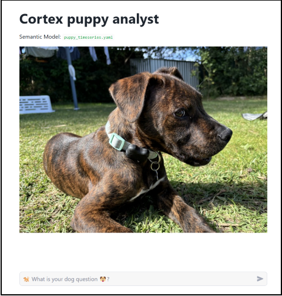
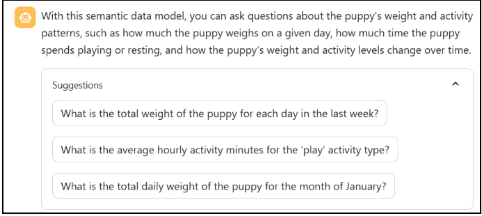
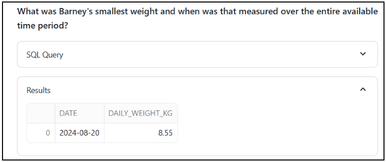
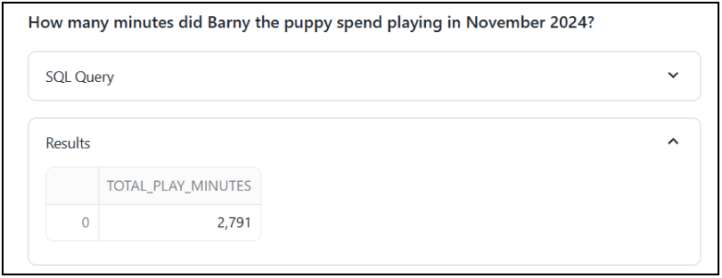
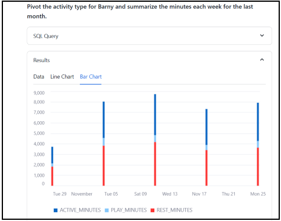

# Puppy Data
🐾 Puppy Data 🐾 combines a love of data and dogs — a project to track Barney the puppy🐶! Using load-cells and low power motion tracking sensors I built an automated system to monitor Barney’s weight, sleep habits, and activity📊. Data is sent to Home Assistant for easy tracking via a slick interface 📱. CotexAI and a Streamlit application allows me to ask questions like _“How much heavier is Barney this month?”_ or _“When was he most active?”_   🐕💡. 

A blend of IoT, DIY tech, and puppy love ❤️📈!

Blog - https://simon-aubury.medium.com/puppy-data-192a25401ccd

# Snowflake Cortex Analyst  
The Snowflake Cortex Analyst of Barney data data is based on the [Getting Started with Cortex Analyst in Snowflake](https://quickstarts.snowflake.com/guide/getting_started_with_cortex_analyst_in_snowflake/index.html#1) exercise

## Demo

Initial landing prompt

`Help`

`What was Barney's smallest weight and when was that measured?`

`Show me the weekly average weight of Barny for the last 3 months.`

`How many minutes did Barny the puppy spend playing last month?`

`On which day in the previous month did Barny play the most?`

`Pivot the activity type for Barny and summarize the minutes each week for the last month.`

`Which hours in the last month have more play minutes than rest minutes?`

