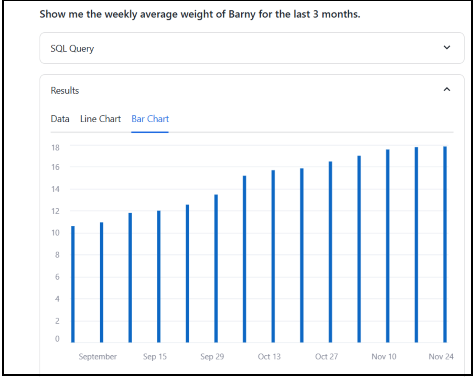
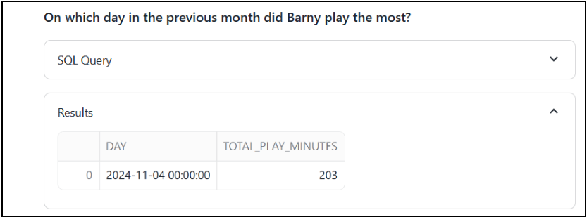
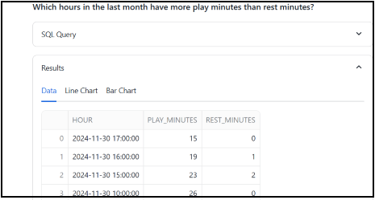

# Snowflake Cortex Analyst  
The Snowflake Cortex Analyst of Barney data data is based on the [Getting Started with Cortex Analyst in Snowflake](https://quickstarts.snowflake.com/guide/getting_started_with_cortex_analyst_in_snowflake/index.html#1) exercise

## Demo

Initial landing prompt

`Help`

`What was Barney's smallest weight and when was that measured?`

`Show me the weekly average weight of Barny for the last 3 months.`

`How many minutes did Barny the puppy spend playing last month?`

`On which day in the previous month did Barny play the most?`

`Pivot the activity type for Barny and summarize the minutes each week for the last month.`

`Which hours in the last month have more play minutes than rest minutes?`

